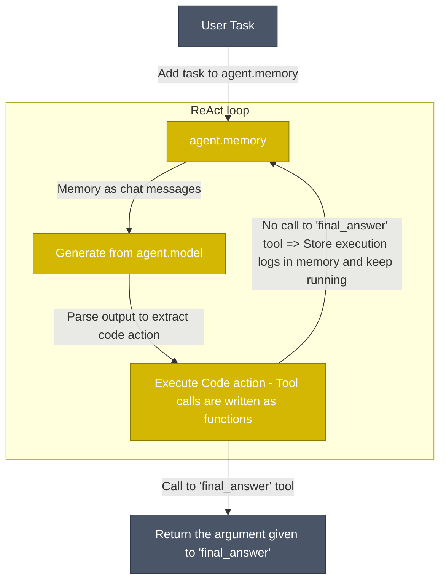

## How do Code agents work?

Our [`CodeAgent`](https://huggingface.co/docs/smolagents/reference/agents#smolagents.CodeAgent) works mostly like classical ReAct agents - the exception being that the LLM engine writes its actions as Python code snippets.

